# Engineering an Apple-Class Spatial Web Architecture

In modern web development, creating an experience that commands attention requires moving far beyond generic templates and boilerplate UI libraries. It demands a deliberate synthesis of **real-time 3D WebGL computation**, **physics-based tactile gestures**, **frame-perfect animation choreography**, and **synthesized Web Audio feedback** — crafted with zero "AI-slop".

During this architecture overhaul of **felich.dev**, our team re-engineered the entire interface pipeline to deliver a billion-dollar standard interactive developer showcase.

Here is the complete engineering breakdown of the key subsystems built and integrated into the platform.

---

## 1. Subsystem Architecture Overview

```mermaid
graph TD
  subgraph Spatial_3D [Three.js WebGL Core Engine]
    W1[Canvas Mount / Seeded PRNG mulberry32] --> W2[Distorted Glass Icosahedron]
    W2 --> W3[Dual Precessing Orbit Rings]
    W3 --> W4[1500 Particle Starfield Vortex]
    W4 --> W5[Real-Time Cursor Gyro Pointer Lerp]
  end

  subgraph Gesture_Controls [Draggable Segmented Sliders]
    G1[Pointer Down / Touch Capture] --> G2[Real-Time Scrub Tracking]
    G2 --> G3[Spring Pill Position Interpolation]
    G3 --> G4[Harmonic Web Audio Sound Tick]
    G4 --> G5[Pointer Up: Commit State Change]
  end

  subgraph Kinetic_Text [Glitch & Typography Engine]
    K1[Solid Pitch Black Hero Title] --> K2[Periodic 4-Phase Scrambler]
    K2 --> K3[Omnidirectional 4-Way Orbit Particles]
    K3 --> K4[Multi-Stage Role Transition Matrix]
  end

  Spatial_3D --> Core[felich.dev Apple-Class Experience]
  Gesture_Controls --> Core
  Kinetic_Text --> Core
```



---

## 2. Interactive Gesture Control: Scrubbable Segmented Slider

Traditional UI switchers rely on instant discrete clicks. For an Apple-tier tactile experience, we engineered a custom `DraggableSegmentedControl` component supporting both discrete clicks and real-time continuous gesture scrubbing on desktop mouse and mobile touchscreens:

```tsx
export default function DraggableSegmentedControl<T extends string>({
  options,
  value,
  onChange,
  ariaLabel,
}: DraggableSegmentedControlProps<T>) {
  const trackRef = useRef<HTMLDivElement>(null);
  const [isDragging, setIsDragging] = useState(false);
  const [previewIndex, setPreviewIndex] = useState<number>(0);

  const calculateIndexFromPointer = useCallback((clientX: number): number => {
    if (!trackRef.current) return 0;
    const rect = trackRef.current.getBoundingClientRect();
    const relativeX = clientX - rect.left;
    const clampedX = Math.max(0, Math.min(relativeX, rect.width));
    const segmentWidth = rect.width / options.length;
    return Math.min(options.length - 1, Math.max(0, Math.floor(clampedX / segmentWidth)));
  }, [options.length]);

  const handlePointerDown = (e: React.PointerEvent<HTMLDivElement>) => {
    e.currentTarget.setPointerCapture(e.pointerId);
    setIsDragging(true);
    setPreviewIndex(calculateIndexFromPointer(e.clientX));
    introAudio.playTick(1.0);
  };

  const handlePointerMove = (e: React.PointerEvent<HTMLDivElement>) => {
    if (!isDragging) return;
    const nextIdx = calculateIndexFromPointer(e.clientX);
    if (nextIdx !== previewIndex) {
      setPreviewIndex(nextIdx);
      introAudio.playTick(0.9 + nextIdx * 0.1);
    }
  };

  const handlePointerUp = (e: React.PointerEvent<HTMLDivElement>) => {
    if (!isDragging) return;
    try { e.currentTarget.releasePointerCapture(e.pointerId); } catch {}
    const finalIdx = calculateIndexFromPointer(e.clientX);
    setIsDragging(false);
    onChange(options[finalIdx].key);
  };

  // ...
}
```

### Key Highlights:
- **Real-Time Follower**: As the user drags across options (e.g. `US` $\rightarrow$ `ID` $\rightarrow$ `ZH` $\rightarrow$ `DE`), the indicator pill glides smoothly with Framer Motion spring dynamics (`stiffness: 600, damping: 35`).
- **Delayed Commit**: State updates to localStorage and React state only fire upon pointer release (`onPointerUp`), preventing layout thrashing during drag.
- **Audio Feedback**: Frequency-modulated sound ticks trigger at each segment crossing.

---

## 3. Multi-Stage Cybernetic Glitch Typography Engine

Instead of generic typewriter delete-and-replace effects, we designed a **4-Phase Cybernetic Glitch State Machine** applied across our hero title and role switcher:

| Phase | Duration | Visual Choreography |
|---|---|---|
| **1. Stable Hold** | `2400ms – 2800ms` | High-contrast solid text display with ambient baseline glow. |
| **2. Pre-Glitch Build-Up** | `~210ms` | Micro-vibration and 35% character jitter with matrix glifs (`!@#$01_`). |
| **3. Peak Matrix Glitch** | `~280ms` | High-velocity flurry with chromatic aberration layers (`#00ffff` Cyan & `#ff0055` Magenta). |
| **4. Left-to-Right Lock-In** | `~200ms` | Sequential character resolution snapping cleanly back into place. |

Surrounding the main title "Felich", an **Omnidirectional 4-Way Particle Field** constantly drifts in four opposite vector directions (Down, Up, Right, Left) utilizing GPU-accelerated CSS keyframe transforms.

---

## 4. Theme-Adaptive Vector SVG Avatar

To ensure complete visual harmony across all three curated themes (**Noir Silver**, **Vanilla Matcha**, **Violet Lavender**), the static monogram was replaced with an architectural SVG path definition:

```tsx
<svg
  width={Math.round(size * 0.48)}
  height={Math.round(size * 0.48)}
  viewBox="0 0 48 48"
  fill="none"
  className="relative z-10 transition-transform duration-300 group-hover:scale-105"
>
  <defs>
    <linearGradient id="felichAvatarGrad" x1="0%" y1="0%" x2="100%" y2="100%">
      <stop offset="0%" stopColor="var(--brand-strong, var(--brand))" />
      <stop offset="100%" stopColor="var(--brand)" />
    </linearGradient>
  </defs>
  <path
    d="M 12 8 L 36 8 C 37.1 8 38 8.9 38 10 L 38 13 C 38 14.1 37.1 15 36 15 L 20 15 L 20 22 L 32 22 C 33.1 22 34 22.9 34 24 L 34 27 C 34 28.1 33.1 29 32 29 L 20 29 L 20 38 C 20 39.1 19.1 40 18 40 L 14 40 C 12.9 40 12 39.1 12 38 Z"
    fill="url(#felichAvatarGrad)"
    stroke="var(--border-default)"
    strokeWidth="0.8"
    strokeLinejoin="round"
  />
  <circle cx="34" cy="36" r="2.8" fill="var(--brand)" opacity="0.9" />
</svg>
```

---

## 5. Verification & Continuous Integration

Every component adheres to strict quality verification standards:

- **ESLint**: 0 errors, 0 warnings across all routes and components.
- **TypeScript**: `tsc --noEmit` exited with code 0.
- **Vitest Unit Test Suite**: **89 of 89 tests passing (100% green)** across 21 test files.
- **A11y Determinism**: Automatic fallback to static rendering when `prefers-reduced-motion: reduce` is detected.

---

## Conclusion

A world-class web application is defined by the depth of its micro-interactions and the precision of its motion physics. By combining Three.js WebGL spatial computing, gesture-scrubbable slider controls, and multi-stage glitch typography, **felich.dev** achieves a modern, high-craft interactive benchmark.
