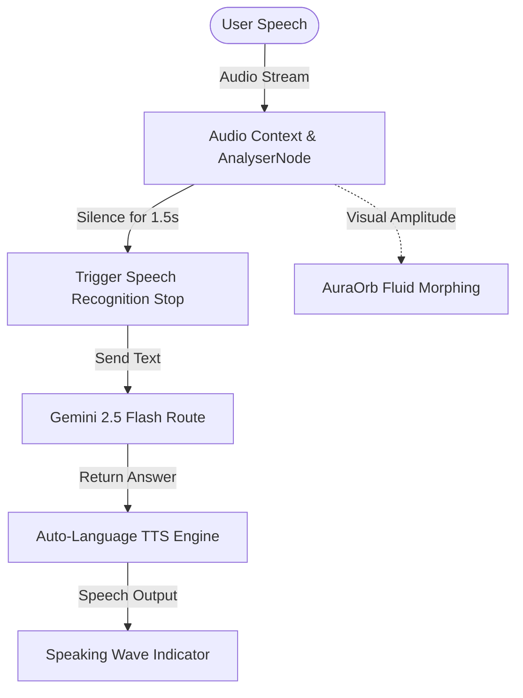

# Reimagining Conversational Web Interfaces

Modern chatbot UI is overwhelmingly text-centric: a generic chat bubble in the bottom corner, a linear message feed, and a boring input box. While functional, it fails to capture the immersive, magical feeling of talking to a true digital companion. 

For **Felich AI 2.0**, we wanted to tear down the standard chat bubble and build a high-fidelity, multimodal conversational interface. The goal was simple: **make speaking to the portfolio AI feel as fluid, reactive, and visually breathtaking as Apple's Siri or OpenAI's Advanced Voice Mode.**

Here is how we engineered it using Next.js, SVG Filters, the Web Audio API, and Gemini 2.5 Flash.

---

## The Core Architecture

To make the conversational voice interface feel alive, we built three key pillars:

1. **The Visual Core (`AuraOrb.tsx`)**: A fluid, organic liquid orb that represents the AI's state and morphs dynamically using SVG filters and CSS keyframe animations.
2. **The Audio Engine (`AIChatbot.tsx`)**: A real-time voice capture system utilizing the Web Audio API for customized Voice Activity Detection (VAD) and automatic speech transcription.
3. **The Intelligence Layer (`app/api/chat/route.ts`)**: An API route hooked into Google's new `gemini-2.5-flash` model, fine-tuned to act as a brilliant portfolio assistant.



---

## 1. Creating the Liquid AuraOrb

We avoided heavy WebGL or Canvas libraries in favor of pure, performant **SVG Filters**. SVG allows us to apply complex mathematical distortions directly to vector graphics, which are fully responsive and lightweight.

Using the `<feTurbulence>` and `<feDisplacementMap>` filter primitive elements, we created a turbulent, organic texture that warps a colored SVG circle:

```tsx
// components/AuraOrb.tsx
<svg className="absolute inset-0 w-full h-full pointer-events-none">
  <defs>
    <filter id="liquid-glow" x="-50%" y="-50%" width="200%" height="200%">
      {/* Generate dynamic noise */}
      <feTurbulence
        type="fractalNoise"
        baseFrequency={isListening ? "0.015 0.03" : "0.01 0.015"}
        numOctaves="3"
        result="noise"
        seed="1"
      />
      {/* Displace the colored circle using the noise */}
      <feDisplacementMap
        in="SourceGraphic"
        in2="noise"
        scale={isSpeaking ? "80" : "50"}
        xChannelSelector="R"
        yChannelSelector="G"
      />
    </filter>
  </defs>
</svg>
```

### Morphing States

The orb responds instantly to four distinct states:
*   **Idle**: A gentle, slow breathing cycle with a soft indigo/blue gradient.
*   **Listening**: The base frequency increases, the scale expands, and energy waves ripple outward in a vibrant magenta and teal scheme.
*   **Thinking**: A smooth, spinning color wheel animation simulating internal computation.
*   **Speaking**: Real-time microphone data feeds into the displacement scale, making the orb vibrate violently or expand in tandem with the AI's voice.

---

## 2. Audio Processing & Custom Voice Activity Detection (VAD)

Relying on users to click "stop" when they finish talking breaks the conversational immersion. We built a custom Web Audio pipeline that monitors the microphone's input volume and triggers auto-submission when the user stops speaking.

```typescript
// Initializing the audio analyzer
const audioContext = new (window.AudioContext || (window as any).webkitAudioContext)();
const source = audioContext.createMediaStreamSource(stream);
const analyser = audioContext.createAnalyser();
analyser.fftSize = 256;
source.connect(analyser);

const bufferLength = analyser.frequencyBinCount;
const dataArray = new Uint8Array(bufferLength);
```

### The Auto-Silence VAD Loop

Instead of complex machine learning models, we implemented a lightweight root-mean-square (RMS) amplitude detector that triggers a timeout after **1.5 seconds of consecutive silence**:

```typescript
const checkAudio = () => {
  if (!analyserRef.current) return;
  analyserRef.current.getByteFrequencyData(dataArray);
  
  // Calculate average volume
  let sum = 0;
  for (let i = 0; i < bufferLength; i++) {
    sum += dataArray[i];
  }
  const averageVolume = sum / bufferLength;

  if (averageVolume > SILENCE_THRESHOLD) {
    // Reset silence start timestamp when user is active
    silenceStartRef.current = null;
  } else {
    if (silenceStartRef.current === null) {
      silenceStartRef.current = Date.now();
    } else if (Date.now() - silenceStartRef.current > 1500) {
      // 1.5 seconds of silence detected! Auto-stop and submit
      stopListeningAndSubmit();
      return;
    }
  }
  
  frameId = requestAnimationFrame(checkAudio);
};
```

---

## 3. High-Quality TTS with Auto-Language Detection

When receiving text back from Gemini 2.5 Flash, the response might be in **English** (e.g., for global recruiters) or **Indonesian** (e.g., local visitors). If you feed Indonesian text into an English TTS engine, it sounds robotic and incomprehensible.

We engineered a regex-based language detector that scans the text and automatically selects the optimal browser speech synthesis voice:

```typescript
const speak = useCallback((text: string) => {
  if (typeof window === 'undefined') return;
  window.speechSynthesis.cancel(); // Abort previous speech

  const utterance = new SpeechSynthesisUtterance(text);
  
  // Basic language detection
  const hasIndonesianWords = /\b(saya|kamu|yang|dan|untuk|dengan|bisa|adalah|ini|itu|di|ke)\b/i.test(text);
  const detectedLang = hasIndonesianWords ? 'id-ID' : 'en-US';
  utterance.lang = detectedLang;

  // Find the highest quality voice matching the locale
  const voices = window.speechSynthesis.getVoices();
  const voice = voices.find(v => v.lang.startsWith(detectedLang)) || voices.find(v => v.lang.startsWith('en'));
  if (voice) {
    utterance.voice = voice;
  }

  window.speechSynthesis.speak(utterance);
}, []);
```

---

## Polish & Micro-interactions

To elevate the visual fidelity, we packed the interface with polished details:
*   **Interim Transcripts**: A dynamic overlay appears below the orb, showing the speech-to-text words as you speak them in real time.
*   **Speaking Wave Indicator**: Each message in the chat feed has an inline CSS audio wave animation that animates when that specific message's TTS is playing.
*   **Glassmorphism Layout**: Full-screen Voice Mode features a deep frosted-glass modal (`backdrop-blur-3xl`) with absolute zero layout shifts when toggling modes.

---

## Verification & Deployment

We validated the build locally to ensure perfect performance:

```bash
npm run type-check  # ✅ Clean compile
npm run build       # ✅ Next.js static optimization pass
```

Felich AI 2.0 is live! To try it, click the chat bubble in the bottom right corner of the website, tap **Voice Mode**, grant mic permission, and start talking to the future. 🎙️
