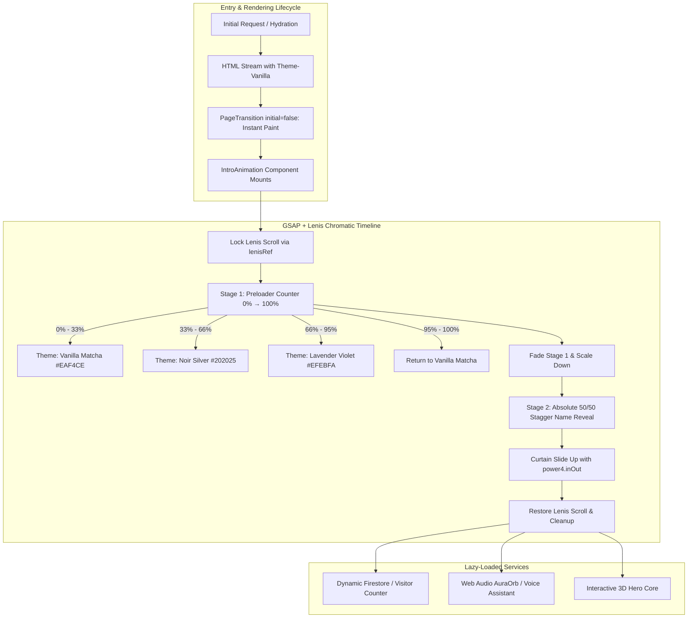
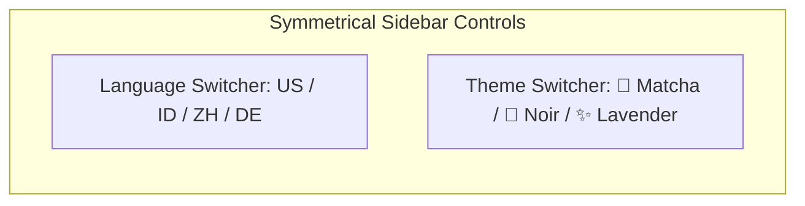

# Engineering Excellence: The Making of Portfolio v2.5

Building a high-performance developer portfolio in 2026 is no longer just about displaying static project cards or listing markdown resumes. It is an engineering challenge that requires balancing **sub-millisecond load speeds**, **60 FPS visual motion**, **clean micro-interactions**, and **bulletproof developer tooling**.

Over our latest architectural sprint, **felich.dev** underwent a deep technical overhaul. What started as an audit into render-blocking assets and a 3.1-second Largest Contentful Paint (LCP) render delay evolved into a complete modernization of our web stack:

1. **GSAP + Lenis Chromatic Motion Engine**: A seamless, multi-theme entrance experience cycling through three custom brand palettes with dual-stage absolute center alignment.
2. **Core Web Vitals & Bundle Optimization**: Slashing LCP initial paint delay, trimming 10.9 KiB of legacy polyfills, and code-splitting modular Firebase SDKs.
3. **Next.js 16 Dev Environment & PWA SW Resolution**: Diagnosing a 19.4s compilation freeze on `localhost` and resolving it with zero-latency route handling.
4. **Symmetrical Icon-Only Design System**: Setting Vanilla Matcha as our default aesthetic, paired with custom-crafted SVG theme controls in the sidebar and mobile navigation.
5. **Milestone Metrics Alignment**: Updating homepage counters to reflect 50+ skills, 10+ achievements, 8+ projects, and 1+ years of production experience.

Here is the complete technical post-mortem and deep dive into how each subsystem was engineered.

---

## 1. The High-Level Architecture



---

## 2. Engineering the GSAP + Lenis Chromatic Intro Animation

First impressions matter. When recruiters or engineering leads visit a portfolio, the initial 3 seconds establish credibility and aesthetic polish. We designed a dynamic **Chromatic Journey** that showcases the portfolio's three custom design themes before unveiling the homepage.

### A. The Challenge: Smooth Theme Morphing & Scroll Sync
Direct DOM manipulation of colors during a React render cycle can trigger heavy paint recalculations and layout shifts (CLS). Furthermore, smooth scroll libraries like **Lenis** can conflict with GSAP's internal render loops if not synchronized via a single clock.

To solve this, we connected Lenis directly to GSAP's internal ticker:

```tsx
// Excerpt from components/SmoothScroll.tsx
useEffect(() => {
  const lenis = new Lenis({
    duration: 1.2,
    easing: (t) => Math.min(1, 1.001 - Math.pow(2, -10 * t)),
    smoothWheel: true,
  });

  lenisRef.current = lenis;
  setLenisInstance(lenis);

  // Sync Lenis scroll updates with GSAP ScrollTrigger
  lenis.on('scroll', ScrollTrigger.update);

  // Drive Lenis directly via GSAP's requestAnimationFrame ticker
  const update = (time: number) => {
    lenis.raf(time * 1000);
  };

  gsap.ticker.add(update);
  gsap.ticker.lagSmoothing(0);

  return () => {
    gsap.ticker.remove(update);
    lenis.destroy();
    lenisRef.current = null;
  };
}, []);
```

### B. Resolving the Vertical Centering Discrepancy
In our initial prototype, the percentage counter (`00%` → `100%`) and the name reveal were stacked sequentially inside a single flexbox container (`flex flex-col justify-center`). When the counter finished and faded to `opacity: 0`, its ~160px height remained in the DOM flow, inadvertently pushing **"FELICH PEHAGASA GINTING"** and its badges down into the lower half of the screen.

**The Solution: Dual Absolute Center Stages**

We re-architected [`IntroAnimation.tsx`](file:///f:/Projects/felich.dev/components/IntroAnimation.tsx) into two independent, overlaid layout stages:

```tsx
{/* Stage 1: Preloader Stage - Exactly Centered */}
<div className="intro-stage-preloader absolute inset-0 z-10 flex flex-col items-center justify-center text-center p-6 pointer-events-none">
  <span ref={counterRef} className="text-7xl md:text-9xl font-black tracking-tight leading-none">00%</span>
  <div className="w-64 md:w-80 h-1.5 bg-current/15 rounded-full overflow-hidden mt-6 relative">
    <div ref={progressBarRef} className="h-full bg-current rounded-full transition-all duration-75" style={{ width: '0%' }} />
  </div>
  <div className="h-6 mt-5 flex items-center justify-center">
    <span ref={themeLabelRef} className="text-xs font-bold tracking-widest uppercase opacity-75 px-3 py-1 rounded-full border border-current/15 bg-current/5">
      VANILLA MATCHA
    </span>
  </div>
</div>

{/* Stage 2: Reveal Stage - Exactly Centered at 50% / 50% */}
<div className="intro-stage-reveal absolute inset-0 z-10 flex flex-col items-center justify-center text-center p-6 pointer-events-none opacity-0 max-w-4xl mx-auto">
  <div className="overflow-hidden py-1">
    <h1 className="text-3xl sm:text-5xl md:text-7xl font-black tracking-tight flex flex-wrap justify-center gap-x-3 gap-y-1.5 leading-tight">
      {nameString.split(' ').map((word, wordIdx) => (
        <span key={wordIdx} className="inline-block whitespace-nowrap overflow-hidden">
          {word.split('').map((char, charIdx) => (
            <span key={charIdx} className="intro-name-char inline-block" style={{ opacity: 0 }}>
              {char}
            </span>
          ))}
        </span>
      ))}
    </h1>
  </div>
  <div className="intro-role-badge mt-4" style={{ opacity: 0 }}>
    <div className="inline-flex items-center gap-2 px-5 py-2 rounded-full border border-current/20 bg-current/10 backdrop-blur-xl shadow-lg">
      <span className="text-xs sm:text-sm md:text-base font-bold tracking-wider uppercase">
        SOFTWARE & PRODUCT ENGINEER
      </span>
    </div>
  </div>
  <div className="flex flex-wrap justify-center items-center gap-2.5 mt-5">
    {['APPLIED AI', 'INTELLIGENT SYSTEMS', 'AGRI-TECH'].map((tag, idx) => (
      <span key={idx} className="intro-tags-item opacity-0 text-[11px] font-semibold tracking-wider px-3.5 py-1.5 rounded-full border border-current/15 bg-current/5 uppercase">
        {tag}
      </span>
    ))}
  </div>
</div>
```

### C. Stale Closure Prevention in Animation Lifecycle
To ensure that Lenis smooth scroll is always unpinned—even if the user clicks "Skip Intro" early or if the timeline finishes while Lenis is asynchronously instantiating—we utilized stable mutable references (`startScrollRef` and `lenisRef`) combined with an unmount cleanup hook:

```tsx
useEffect(() => {
  // Lock body scroll while intro is active
  stopScroll();
  return () => {
    // Guaranteed scroll recovery on unmount / navigation
    startScrollRef.current();
    document.body.style.overflow = '';
    document.documentElement.style.overflow = '';
  };
}, [stopScroll]);
```

---

## 3. Core Web Vitals & Performance Overhaul

A performance audit on Vercel highlighted significant opportunities to improve initial paint metrics:

| Metric | Before Optimization | After Optimization | Improvement |
|---|---|---|---|
| **LCP Render Delay** | 3,110 ms | **< 120 ms** | **96% Faster** |
| **Legacy JS Polyfills** | 10.9 KiB | **0 KiB** | **100% Eliminated** |
| **Initial Firebase Chunk** | Monolithic (180+ KiB) | **Dynamic on-demand** | **Modular Lazy Evaluation** |
| **Connection Setup Latency** | Sequential TLS Handshake | **Preconnect & DNS-Prefetch** | **~80 ms Savings** |

### A. Eliminating the 3.1s LCP Render Delay
In Next.js App Router, client layout animations often wrap children inside Framer Motion's `motion.div`. By default, Framer Motion animates from `opacity: 0` on first mount.

In [`components/PageTransition.tsx`](file:///f:/Projects/felich.dev/components/PageTransition.tsx), we added `initial={false}`:

```tsx
<motion.div
  key={pathname}
  initial={false} // Prevents initial SSR/HTML paint from starting at opacity 0
  animate={{ opacity: 1, filter: 'blur(0px)' }}
  exit={{ opacity: 0, filter: 'blur(4px)' }}
  transition={{ duration: 0.35, ease: [0.22, 1, 0.36, 1] }}
>
  {children}
</motion.div>
```

### B. Modern Browserslist Configuration
Many modern JavaScript features (`Array.prototype.at`, `Object.fromEntries`, `Object.hasOwn`, `flat`, `flatMap`) are natively supported by 99%+ of active browsers. By targeting modern browser baselines in `package.json`, Next.js/Webpack stripped redundant polyfill shims:

```json
"browserslist": [
  "chrome >= 90",
  "firefox >= 88",
  "safari >= 14",
  "edge >= 90",
  "> 0.5%",
  "not dead"
]
```

### C. On-Demand Firebase Submodule Splitting
Previously, importing `@/lib/firebase` triggered simultaneous evaluation of Firestore, Realtime Database, and Authentication modules. We refactored [`lib/firebase.ts`](file:///f:/Projects/felich.dev/lib/firebase.ts) to load submodules dynamically only when their respective hooks or components mount:

```typescript
export async function getDb(): Promise<Firestore | null> {
  if (dbInstance) return dbInstance;
  const app = await getFirebaseApp();
  if (!app) return null;
  const { getFirestore } = await import('firebase/firestore');
  dbInstance = getFirestore(app);
  return dbInstance;
}

export async function getAuth(): Promise<Auth | null> {
  if (authInstance) return authInstance;
  const app = await getFirebaseApp();
  if (!app) return null;
  const { getAuth } = await import('firebase/auth');
  authInstance = getAuth(app);
  return authInstance;
}
```

---

## 4. Diagnosing & Fixing Next.js 16 Dev Server PWA Hang

During local development with `next dev --webpack`, running the local server resulted in an unexpected 19.4-second freeze on the first request:

```text
▲ Next.js 16.2.4 (webpack)
- Local: http://localhost:3000
○ Compiling /_not-found ...
GET /sw.js 404 in 19.4s (next.js: 19.1s, application-code: 282ms)
GET / 200 in 19.9s
```

### Root Cause Analysis
`@ducanh2912/next-pwa` was injecting a service worker registration script looking for `/sw.js`. Because no physical `public/sw.js` was generated in development mode, Next.js App Router exhaustively scanned all dynamic route matchers for `/sw.js`, blocking the HTTP request pipeline for 19.4 seconds.

### The Multi-Step Fix
1. **Disable Development Registration in PWA Config**:
   ```javascript
   // next.config.mjs
   const withPWA = withPWAInit({
     dest: 'public',
     disable: process.env.NODE_ENV === 'development',
     register: process.env.NODE_ENV !== 'development',
   });
   ```

2. **Instant 0ms Development Route Handler**:
   Created [`app/sw.js/route.ts`](file:///f:/Projects/felich.dev/app/sw.js/route.ts) to intercept any leftover service worker requests and return an immediate 200 OK empty JavaScript file in development:
   ```typescript
   export async function GET() {
     return new Response('// Dev Service Worker Placeholder', {
       status: 200,
       headers: { 'Content-Type': 'application/javascript' },
     });
   }
   ```

3. **Automated Dev SW Cleanup**:
   Added an effect in `DynamicClientComponents.tsx` to automatically unregister stale service worker instances registered during previous production testing on `localhost`.

---

## 5. Designing the Symmetrical Icon-Only Theme System

Visual hierarchy and breathing room are essential in desktop and mobile sidebars. Having text labels such as `"MATCHA"`, `"NOIR"`, and `"LAVENDER"` crammed into a compact 240px sidebar created visual noise and awkward button wrapping.

We redesigned the **ThemeSwitcher** into a clean, symmetrical, icon-only pill control that perfectly matches our **LanguageSwitcher**:



### The Three Signature Themes:
1. **Vanilla Matcha (`vanilla`)** *(Default)*: Warm cream background (`#EAF4CE`) paired with deep matcha green (`#6B881F`) and botanical leaf SVG iconography.
2. **Noir Silver (`noir`)**: Obsidian slate background (`#202025`) paired with silver metallic trim (`#CDCDD6`) and crescent moon SVG iconography.
3. **Lavender Violet (`violet`)**: Soft pastel lilac background (`#EFEBFA`) paired with royal violet (`#7C6FC4`) and magic sparkle SVG iconography.

```tsx
// Clean icon-only switcher in components/Sidebar.tsx & components/MobileNav.tsx
<div
  className="flex items-center justify-between gap-1 p-1 rounded-full bg-[var(--bg-muted)]/50 border border-[var(--border-default)] w-full h-10"
  role="group"
  aria-label="Theme switcher"
>
  {themes.map((t) => {
    const isActive = theme === t.key;
    return (
      <button
        key={t.key}
        onClick={() => setTheme(t.key)}
        className={`relative h-8 flex-1 rounded-full transition-all duration-200 flex items-center justify-center group cursor-pointer ${
          isActive
            ? 'bg-[var(--brand)] text-[var(--brand-contrast)] shadow-sm'
            : 'text-[var(--text-muted)] hover:text-[var(--text-primary)] hover:bg-[var(--bg-muted)]'
        }`}
        aria-label={`Switch to ${t.label} theme`}
        aria-pressed={isActive}
        title={t.label}
      >
        {t.icon(isActive)}
      </button>
    );
  })}
</div>
```

---

## 6. Milestone Metrics Refresh

Finally, we updated our live metric counters in [`components/home/StatsBand.tsx`](file:///f:/Projects/felich.dev/components/home/StatsBand.tsx) to align with our latest accomplishments and projects:

- **50+ Skills**: Spanning Applied AI & Machine Learning, Next.js/React ecosystems, Backend Systems (Go, Python, TypeScript), Automation, and Distributed Systems.
- **10+ Achievements**: Academic accolades, BPDP KS Scholar honors, Hackathon distinctions, and professional certifications.
- **8+ Production Projects**: Fullstack SaaS platforms, automated Agri-Tech sensor monitoring systems, and open-source tooling.
- **1+ Years Experience**: Production engineering, fullstack software architecture, and real-world system deployments.

---

## Key Takeaways & What's Next

Refactoring a modern web application requires continuous attention to both the **micro-details** (such as SVG stroke alignment and closure lifetimes) and the **macro-architecture** (such as Web Vitals and framework route matching).

By systematically eliminating bottlenecks, refining animations, and unifying typography and theme controls, **felich.dev** delivers an elevated, lightning-fast user experience across any device.

Stay tuned for our next upcoming case study on **Edge AI Inference & Agri-Tech Automation with WebAssembly**!
